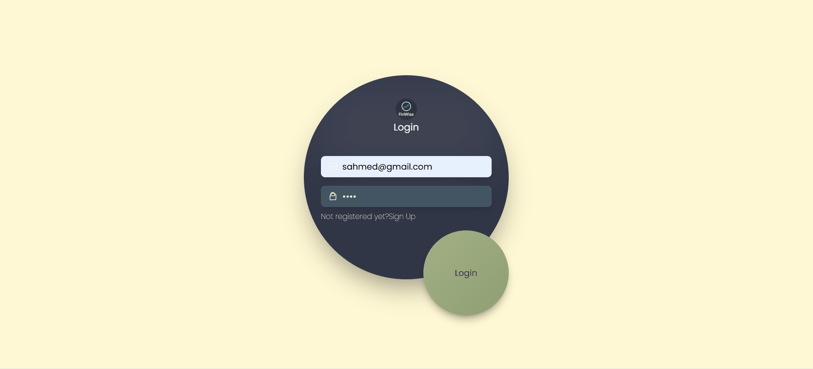

# Finance Manager

A full-stack finance management web application with AI-powered expense predictions. Track your income, expenses, remaining balance, and visualize spending trends over time. The app supports multiple users and provides a simple dashboard for financial insights.

🚀 Live Demo

[](client/src/assets/FInanceManager.gif)
---

## Features

- **User Authentication** – Register and login to securely access your dashboard.  
- **Income & Expense Tracking** – Add and view monthly income and expenses.  
- **Category Analysis** – See the category where you spend the most.  
- **Remaining Balance** – Automatically calculate your remaining balance each month.  
- **AI Predictions** – Predict next month’s expenses using a simple AI model.  
- **Charts & Visualizations** – Interactive charts for income vs expenses.  
- **Responsive Design** – Works on desktop and mobile devices.  

---

## Tech Stack

- **Frontend:** React.js, Tailwind CSS, Recharts  
- **Backend:** Node.js, Express.js, MySQL (with `mysql2/promise`)  
- **AI / ML:** Python (Flask) for expense prediction  
- **Database:** MySQL  
- **Environment Variables:** Managed with `.env` file  

---

## Folder Structure

finance-manager/
├─ backend/ # Node.js & Express backend
│ ├─ controller/
│ ├─ routes/
│ ├─ server.js
│ └─ .env
├─ ml_integration/ # Python AI/ML backend
│ ├─ app.py
│ └─ venv/
├─ frontend/ # React.js frontend
│ ├─ src/
│ └─ package.json
├─ .gitignore
└─ README.md

---

## Getting Started

### Prerequisites

- Node.js >= 16  
- Python >= 3.9  
- MySQL database  

---

### 1️⃣ Clone the repository

```bash
git clone https://github.com/samIRaahmeD6/FinWise.git
cd finance-manager
cd backend
npm install
###Create a .env file:

DB_HOST=localhost
DB_USER=root
DB_PASSWORD=your_password
DB_NAME=finance_manager
PORT=3000
node server.js

3️⃣ Setup ML Integration (Python)
cd ml_integration
python -m venv venv
venv\Scripts\activate        # Windows
# or
source venv/bin/activate     # Mac/Linux

pip install -r requirements.txt

##Run the Flask server:

python app.py

4️⃣ Setup Frontend
cd frontend
npm install
npm start
